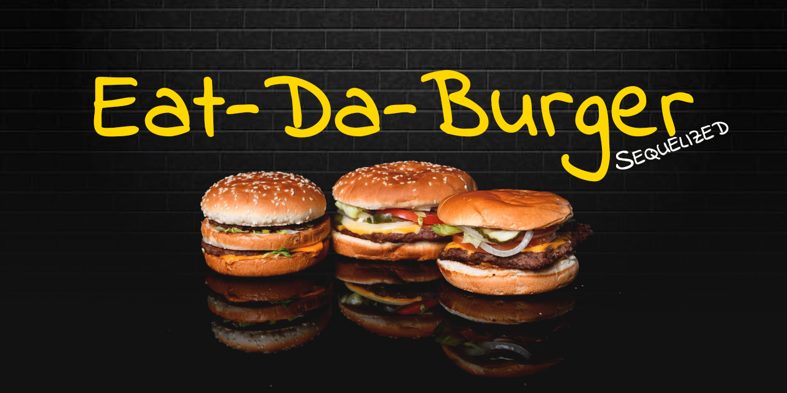

# sequelizedBurger - Burger 2: The Sequel

### Overview

This homework assignment is optional.
In this assignment, you're going to Sequelize the Burger app you made last unit. We've split this exercise into three different tiers, all with different tasks and expectations. Finish whichever tier will provide you with the most reasonable challenge.

### Instructions

Put in your best efforts to complete one of the three available challenge tiers. Remember to deploy your assignment to Heroku once complete.

#### Tier 1: Sequelized! (Basic to Moderate) - Done!

* Remove all references to your vanilla MySQL queries and replace them with Sequelize queries.
* That means:
  * Replacing your MySQL Burger model with a Sequelized equivalent.
  * Don't forget to edit the model and initial migration file to make the burger's devoured field carry a default value of false -- otherwise you might encounter bugs.
  * There's no option to include that default in the command line, so you'll need to open up your editor to make this change.
* Don't forget to sync the models!
* Edit your new config.json file to include your database configurations. Place your JawsDB details in the production property of your json file; the details of your local database go in the developer property.
* Remove your old ORM file, as well as any references to it in burgers_controller.js. Replace those references with Sequelize's ORM methods.

#### Tier 2: Customer Associations (Challenge) - Done!

* Add in a Customer association to the project. This will involve creating at least one new Customer model and connecting it with your Burger model.
* What kind of association you would like to use is up to you. Does a Customer have one Burger? Many Burgers?
* For example, you could make a site that logs the name of which Customer ate which Burger, where each Customer only gets one Burger. If you can't think of another type of association, try this one!

#### Bonus! (Challenge) - Done!

* Add validations to your models where:
  * A burger's name cannot be null
  * A burger's devoured status is false by default
  * A Customer's name cannot be null
* Order the Burgers you send back to the user in alphabetical order using the Sequelize "order" option.

### Technologies and npm packages used

* Express
* JavaScript
* Node.js
* jQuery
* AJAX
* Bootstrap
* MySQL
* Handlebars
* Sequelize

---

[Project demo](https://dry-harbor-65792.herokuapp.com/)

---

**Optimized for 1920x1080 screen resolution and Google Chrome Version 78**

_Made for University of Arizona Coding Bootcamp, Week-15, November 2019_